# CentaurLoop Case: SparkGEO

**English** | [中文](#中文)

SparkGEO is the first public case project for **CentaurLoop**: a human-in-the-loop AI workflow that plans content, asks for human approval, generates publish-ready drafts, routes them through a manual publishing workspace, crawls published links for feedback, and turns the result into reusable memory for the next loop.

This repository is intentionally built as a complete product prototype rather than a toy demo. It shows how a domain-specific AI employee can coordinate with a human operator across a full business cycle.

## What SparkGEO Demonstrates

- **CentaurLoop workflow model**: AI work phases, human gates, reminders, publishing, feedback, review, and memory.
- **Content growth use case**: weekly multi-platform planning for Xiaohongshu, WeChat, Moments, Douyin, SEO/GEO articles, and Zhihu.
- **Human approval gates**: the user confirms plans, reviews drafts, manually publishes, and approves memories.
- **Publishing workspace**: generated drafts are routed into an internal article publishing page for formatting review, copy, and publish confirmation.
- **Article image assist**: the publishing page can generate a cover preview and image prompt from the article and workspace image settings.
- **AI feedback crawling**: after publishing, the user pastes article links and the system reads public pages to analyze performance signals.
- **Live memory workspace**: current-cycle signals, a wiki-style long-term memory graph, and the editable company profile stay visible beside the conversation.
- **Workspace settings**: platform selection, UI/output language, writing style, CTA style, emoji level, image style, and BYOK model settings are configurable.
- **Runtime flexibility**: supports a built-in experience runtime, OpenAI-compatible endpoints, Ollama, LM Studio-style local servers, and BYOK text/image models from Settings.

## Product Flow

```mermaid
flowchart LR
  A["User describes weekly goal"] --> B["AI plans content mix"]
  B --> C["Human approves plan"]
  C --> D["AI generates formatted drafts"]
  D --> E["Human reviews drafts"]
  E --> F["Publishing workspace"]
  F --> G["Human manually publishes"]
  G --> H["User pastes published links"]
  H --> I["AI crawls and analyzes feedback"]
  I --> J["AI reviews the cycle"]
  J --> K["Human approves memories"]
  K --> A
```



## Screens and Modules

| Area | Description |
| --- | --- |
| Onboarding | A lightweight floating modal for collecting initial brand memory. |
| Chat loop | Conversational control surface for the loop state machine. |
| Progress bar | Maps engine stages to planning, generation, publishing, feedback, and review. |
| Draft cards | Shows generated content with formatted Markdown preview and copy actions. |
| Publishing page | Lets users review generated content, copy it, and mark each item as published. |
| Feedback form | Accepts published article URLs and runs AI-powered feedback extraction. |
| Memory workspace | A right-side live panel ordered by current-cycle memory, all-memory wiki graph, then company profile editing and imports. |
| Runtime settings | Lets users choose the underlying runtime foundation. |
| BYOK settings | Keeps separate text-generation and image-generation API keys, base URLs, and model names in a dedicated BYOK tab. |

## Architecture

SparkGEO is a single-page React application with a local Vite API layer for runtime and crawling adapters.

```text
src/
  adapters/        Runtime, model, memory, and tool registry adapters
  core/            CentaurLoop state machine, planner, executor, reviewer, notifier
  core/loopConfigs SparkGEO loop configuration
  protocol/        Chat protocol and user action translation
  spark/           Brand profile, Firecrawl, and published-link feedback services
  ui/              Product UI components
```

Key design boundary:

- `core/` is the reusable loop engine.
- `core/loopConfigs/sparkGeoLoop.ts` defines the SparkGEO case.
- `protocol/loopChat.ts` translates engine state into conversational UI.
- `adapters/` keeps model, memory, runtime, and tool integrations replaceable.
- `spark/` contains SparkGEO-specific brand and feedback services.

More detail is available in [docs/ARCHITECTURE.md](docs/ARCHITECTURE.md).

Upgrade notes are tracked in [docs/UPGRADE_NOTES.md](docs/UPGRADE_NOTES.md).

## Tech Stack

- React 18
- TypeScript
- Vite
- Zustand
- Tailwind CSS
- Framer Motion
- Lucide React
- GitHub Actions for CI

## Getting Started

### Prerequisites

- Node.js 18 or newer
- npm

### Install

```bash
npm install
```

### Run locally

```bash
npm run dev
```

The Vite dev server defaults to:

```text
http://localhost:5190
```

You can also run it on a specific host and port:

```bash
npm run dev -- --host 127.0.0.1 --port 5191
```

### Build

```bash
npm run build
```

### Type check

```bash
npm run typecheck
```

## Runtime Configuration

SparkGEO works without external credentials through its built-in deterministic experience runtime. To connect a real model, copy `.env.example` into `.env.local` and set:

```bash
SPARK_MODEL_BASE_URL=https://api.openai.com/v1
SPARK_MODEL_API_KEY=your_key_here
SPARK_MODEL_NAME=gpt-4o-mini
```

You can also choose Ollama, LM Studio, environment-based OpenAI-compatible runtimes, or configure BYOK inside **Settings -> BYOK** with separate text and image API keys, base URLs, and model names.

## Firecrawl and Published Link Feedback

There are two crawling-related paths:

- **Company profile enrichment**: optional Firecrawl-powered website extraction, plain URL reading, and PDF/TXT uploads live inside the Memory workspace company profile tab. First-run onboarding does not ask for Firecrawl because users may not have a key yet.
- **Published article feedback**: after manual publishing, users paste public article URLs. The app fetches readable page text through the local Vite API and asks AI to extract public metrics or qualitative feedback signals.

The app does not automate publishing to third-party platforms. It intentionally keeps publishing as a human step for this case project.

## Current Status

This is a polished case prototype for the CentaurLoop pattern. It is suitable for local demos, product exploration, and architecture discussion.

Production hardening still requires:

- A deployable backend for `/api/model`, `/api/firecrawl/scrape`, and `/api/published/read`.
- Durable multi-user memory storage.
- Authentication and workspace isolation.
- Real platform publishing integrations.
- Robust scraping adapters for platform-specific metrics.

See [docs/ROADMAP.md](docs/ROADMAP.md).

## Contributing

Contributions are welcome. Please read [CONTRIBUTING.md](CONTRIBUTING.md) before opening issues or pull requests.

## Security

Please do not open public issues for security-sensitive findings. See [SECURITY.md](SECURITY.md).

## License

MIT License. See [LICENSE](LICENSE).

---

# 中文

SparkGEO 是 **CentaurLoop** 的第一个公开案例项目：一个人机协同的 AI 内容增长闭环。它会规划内容、等待人工确认、生成可发布草稿、进入人工发布工作台、通过发布链接抓取反馈，并把复盘结果沉淀为下一轮可复用的记忆。

这个仓库不是玩具 demo，而是一个完整产品原型。它展示了一个面向具体业务场景的 AI employee 如何和人类操作者一起跑完一个业务周期。

## SparkGEO 展示了什么

- **CentaurLoop 工作流模型**：AI 工作阶段、人工卡点、提醒、发布、反馈、复盘、记忆。
- **内容增长场景**：每周多平台内容规划，覆盖小红书、公众号、朋友圈、抖音、SEO/GEO 文章、知乎。
- **人工确认节点**：用户确认计划、审核草稿、人工发布、确认记忆。
- **文章发布页**：生成内容先进入内部发布页，用户检查排版、复制正文、确认已发布。
- **AI 抓取反馈**：发布后用户粘贴文章链接，系统读取公开页面并由 AI 提炼表现信号。
- **品牌记忆**：品牌档案和偏好会存入记忆，并注入后续规划与生成。
- **文章配图辅助**：发布页可以根据文章和图片设置生成封面预览与图片提示词。
- **实时记忆工作区**：本轮动态记忆、长期记忆 wiki 关系图、企业档案编辑和资料导入会常驻显示在对话右侧。
- **工作台设置**：可配置发布平台、界面/输出语言、语言风格、CTA、Emoji、图片风格和 BYOK 模型设置。
- **灵活运行时**：支持内置体验运行时、OpenAI-compatible 接口、Ollama、LM Studio 本地服务，以及设置里的 BYOK 文本/图片模型。

## 产品流程


## 页面和模块

| 区域 | 说明 |
| --- | --- |
| 启动引导 | 轻量悬浮窗，用于建立初始品牌记忆。 |
| 对话闭环 | 用聊天界面承载状态机和用户动作。 |
| 进度条 | 把引擎阶段映射成规划、生成、发布、反馈、复盘。 |
| 草稿卡片 | 展示 Markdown 排版预览和复制操作。 |
| 文章发布页 | 检查生成内容、复制正文、逐篇标记发布。 |
| 反馈表单 | 粘贴已发布文章 URL，由 AI 抓取并分析反馈。 |
| 记忆工作区 | 常驻右侧，按本轮动态记忆、全部记忆 wiki 图谱、企业档案编辑与导入三个层级组织。 |
| 运行时设置 | 在设置中选择底层模型运行时。 |
| BYOK 设置 | 单独的 BYOK 标签页集中管理文本生成和图片生成两套独立的 API Key、Base URL 和模型名称。 |

## 架构

SparkGEO 是一个 React 单页应用，并使用 Vite dev server 提供本地 API 适配层。

```text
src/
  adapters/        Runtime、模型、记忆、工具注册表适配器
  core/            CentaurLoop 状态机、规划器、执行器、复盘器、提醒器
  core/loopConfigs SparkGEO 闭环配置
  protocol/        对话协议和用户动作翻译
  spark/           品牌档案、Firecrawl、发布链接反馈服务
  ui/              产品 UI 组件
```

核心边界：

- `core/` 是可复用的闭环引擎。
- `core/loopConfigs/sparkGeoLoop.ts` 定义 SparkGEO 案例。
- `protocol/loopChat.ts` 把引擎状态翻译成聊天 UI。
- `adapters/` 让模型、记忆、runtime、工具集成保持可替换。
- `spark/` 放 SparkGEO 特有的品牌和反馈服务。

更多说明见 [docs/ARCHITECTURE.md](docs/ARCHITECTURE.md)。

升级说明见 [docs/UPGRADE_NOTES.md](docs/UPGRADE_NOTES.md)。

## 技术栈

- React 18
- TypeScript
- Vite
- Zustand
- Tailwind CSS
- Framer Motion
- Lucide React
- GitHub Actions CI

## 本地启动

### 环境要求

- Node.js 18 或更新版本
- npm

### 安装依赖

```bash
npm install
```

### 本地运行

```bash
npm run dev
```

默认地址：

```text
http://localhost:5190
```

也可以指定 host 和端口：

```bash
npm run dev -- --host 127.0.0.1 --port 5191
```

### 构建

```bash
npm run build
```

### 类型检查

```bash
npm run typecheck
```

## 模型配置

SparkGEO 不配置外部凭据也可以运行，会使用内置确定性体验运行时。要接入真实模型，可以复制 `.env.example` 为 `.env.local` 并配置：

```bash
SPARK_MODEL_BASE_URL=https://api.openai.com/v1
SPARK_MODEL_API_KEY=your_key_here
SPARK_MODEL_NAME=gpt-4o-mini
```

也可以在 **设置 -> 模型与集成** 中选择 Ollama、LM Studio、环境变量配置的 OpenAI-compatible 运行时，并在 **设置 -> BYOK** 中分别填写文本和图片的 API Key、Base URL 和模型名称。

## Firecrawl 与发布链接反馈

项目里有两条抓取路径：

- **企业档案补充**：可选 Firecrawl 官网抓取、普通 URL 读取和 PDF/TXT 上传都放在记忆工作区的企业档案页。首次启动不要求用户填写 Firecrawl，因为用户当时可能还没有 Key。
- **发布链接反馈**：人工发布后，用户粘贴公开文章链接。应用通过本地 Vite API 读取页面文本，再由 AI 提取公开指标或内容质量反馈信号。

当前项目不做第三方平台全自动发布。这个案例刻意把发布保留为人工步骤，便于体现 CentaurLoop 的人机协作边界。

## 当前状态

这是一个打磨过的 CentaurLoop 案例原型，适合本地演示、产品探索和架构讨论。

生产化仍需要：

- 可部署的后端来承载 `/api/model`、`/api/firecrawl/scrape`、`/api/published/read`。
- 持久化、多用户的记忆系统。
- 登录鉴权和工作区隔离。
- 真实平台发布集成。
- 面向平台指标的稳定抓取适配器。

见 [docs/ROADMAP.md](docs/ROADMAP.md)。

## 参与贡献

欢迎提交 Issue 和 Pull Request。请先阅读 [CONTRIBUTING.md](CONTRIBUTING.md)。

## 安全

如果发现安全问题，请不要直接创建公开 Issue。请阅读 [SECURITY.md](SECURITY.md)。

## 许可证

MIT License。见 [LICENSE](LICENSE)。
