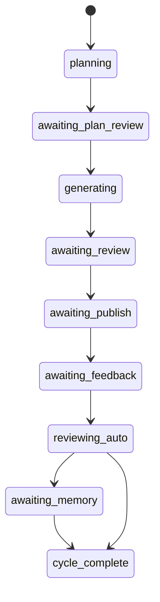

# Architecture

SparkGEO is organized around one product idea: a CentaurLoop is a business cycle where AI advances work until a human gate is required, then continues after the human decision.

## Layers

```text
UI layer
  ChatPanel, cards, onboarding, settings, memory panel, publishing page

Protocol layer
  LoopChatController
  Translates user text and button actions into loop actions

Core engine
  loopEngine
  loopPlanner
  loopExecutor
  loopReviewer
  loopNotifier
  loopStore

Adapters
  ai-client
  runtime
  memory
  tool-registry

SparkGEO services
  brandStore
  brandMemory
  firecrawlService
  publishedFeedbackService
```

## Loop State Machine



## Human Gates

| Gate | Stage | Purpose |
| --- | --- | --- |
| Plan review | `awaiting_plan_review` | Human approves the content plan. |
| Draft review | `awaiting_review` | Human reviews generated drafts. |
| Publishing | `awaiting_publish` | Human publishes through the internal publishing workspace. |
| Feedback | `awaiting_feedback` | Human pastes published links; AI crawls feedback. |
| Memory review | `awaiting_memory` | Human approves lessons before they become memory. |

## Runtime Model

The app can run in two modes:

- **Demo mode**: deterministic local responses for product walkthroughs.
- **Real model mode**: OpenAI-compatible chat completion API through user settings or environment variables.

The runtime adapter is intentionally thin so the model provider can be replaced without changing the loop engine.

## Memory Model

The current case stores memory in browser `localStorage`.

Memory sources include:

- Brand profile
- Brand tone and preferences
- Cycle review lessons
- Facts learned from prior performance
- Corrections approved by the human

This is enough for a local case project. A production version should move memory to a durable backend with workspace ownership and retrieval quality controls.

## Published Link Feedback

Published link feedback has three steps:

1. User pastes the public URL for each published artifact.
2. The local Vite API reads public page text from `/api/published/read`.
3. AI extracts visible metrics or qualitative signals and writes feedback back to the matching task.

This design keeps publishing manual while making feedback collection less tedious than hand-entered metrics.

---

# 架构说明

SparkGEO 围绕一个产品思想组织：CentaurLoop 是一个业务周期，AI 会自动推进工作，直到遇到需要人类决策的卡点；人类处理后，AI 继续推进。

## 分层

```text
UI 层
  ChatPanel、卡片、启动引导、设置、记忆面板、文章发布页

协议层
  LoopChatController
  把用户文字和按钮动作翻译成闭环动作

核心引擎
  loopEngine
  loopPlanner
  loopExecutor
  loopReviewer
  loopNotifier
  loopStore

适配层
  ai-client
  runtime
  memory
  tool-registry

SparkGEO 服务
  brandStore
  brandMemory
  firecrawlService
  publishedFeedbackService
```

## 闭环状态机


## 人工卡点

| 卡点 | 阶段 | 作用 |
| --- | --- | --- |
| 计划确认 | `awaiting_plan_review` | 人确认内容计划。 |
| 草稿审核 | `awaiting_review` | 人审核 AI 生成的草稿。 |
| 发布 | `awaiting_publish` | 人通过内部发布工作台完成发布。 |
| 反馈 | `awaiting_feedback` | 人粘贴发布链接，AI 抓取反馈。 |
| 记忆确认 | `awaiting_memory` | 人确认经验是否沉淀为长期记忆。 |

## Runtime 模型

应用支持两种模式：

- **Demo 模式**：用于产品演示的确定性本地响应。
- **真实模型模式**：通过用户设置或环境变量接入 OpenAI-compatible chat completion API。

Runtime adapter 故意保持轻量，使模型服务可以替换，而不影响闭环引擎。

## 记忆模型

当前案例使用浏览器 `localStorage` 存储记忆。

记忆来源包括：

- 品牌档案
- 品牌调性和偏好
- 每轮复盘经验
- 历史表现事实
- 人类确认过的纠正

这足够支撑本地案例项目。生产版本应迁移到具备工作区归属和检索质量控制的持久化后端。

## 发布链接反馈

发布链接反馈分三步：

1. 用户为每个已发布内容粘贴公开 URL。
2. 本地 Vite API 通过 `/api/published/read` 读取公开页面文本。
3. AI 提取公开指标或定性信号，并写回对应任务。

这个设计保留人工发布边界，同时避免让用户繁琐地手填指标。
